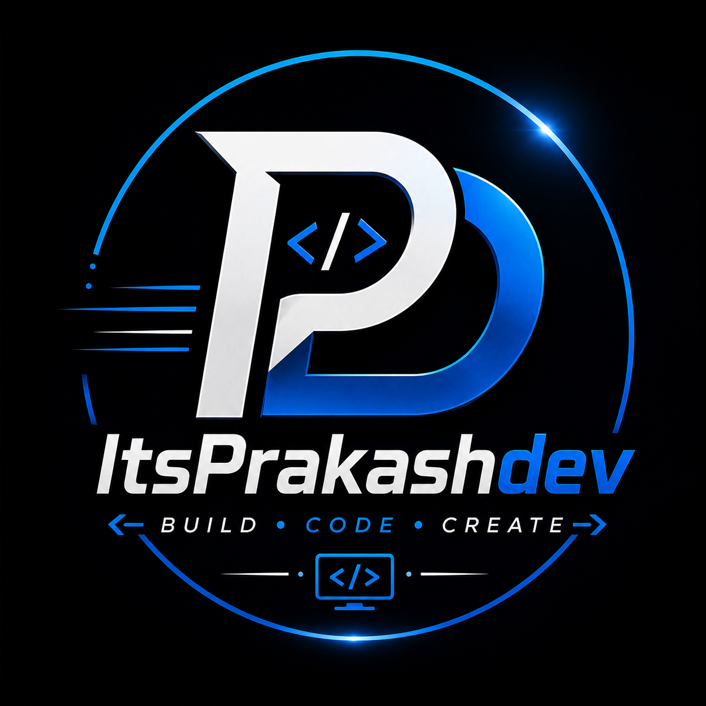

# 👋 Hi, I'm Prakash Kumar

### 💻 Aspiring Software Developer

---

# 🚀 About Me

🎓 B.Tech CSE Student

💻 Learning **C++, DSA, HTML, CSS, JavaScript & React**

🔥 Building Real World Projects

🎯 Goal: Become a Software Developer

📍 West Champaran, Bihar, India

---

# 🛠 Tech Stack

---

# 📊 GitHub Stats

---

# 🔥 GitHub Streak

---

# 🌐 Connect With Me

---

## ⚡ Build • Code • Create ⚡

⭐ Thanks for visiting my profile ⭐

---

## 🌱 Currently Learning

- C++
- Data Structures & Algorithms
- HTML5
- CSS3
- JavaScript
- React

---

## 📊 GitHub Stats

---

## 🔥 GitHub Streak

---

## 📫 Connect With Me

---

## 🚀 Motto

### **Build • Code • Create**

⭐ Thanks for visiting my profile ⭐

